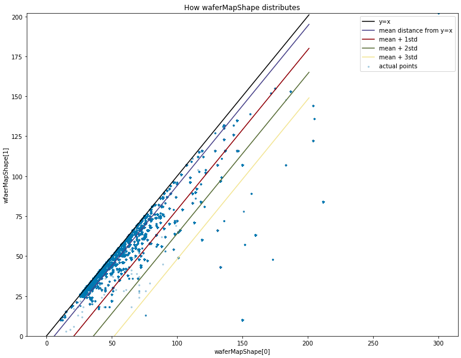

# Semicon

## [WM-811K(LSWMD)](http://mirlab.org/dataSet/public/)

214 MB

811457 wafer maps, in which each wafer map was collected from real-world fabrication. Domain experts were recruited to annotate the pattern type for approximately 20% of the wafer maps in the WM-811K dataset. This dataset is published by Roger Jang, professor of [MIR lab](http://mirlab.or).
  
  
  
   
  
## About Dataset

### First Row of Dataset        

| WaferMap | dieSize | lotName | waferIndex     | trainTestLabel                           |failureType|
| -------- | ------------------ | ----------------- | -------------- | -------------------------- |----|
| [[0,0,0,0,0,0,0,0 ..   | 1683.0               | lot1             | 1.0 | [[Training]]                 |[[none]]|
| ... | ...| ...| ...| ... | ...|

### Attributes Explanation

1) **WaferMap** : WaferMap represented as weight * height size numpy array
  - 0 : Area that die doesn't exist
  - 1 : Area that normal die exists
  - 2 : Area that defect die exists
2) **dieSize** : # of all dies in wafer
3) **lotName** : Name of the lot, ascending order
4) **waferIndex** : Index of the wafer in correspoding lot. Every lot is supposed to have 25 wafers, but some of them don't have 25 wafers
5) **trainTestlabel** : Label for separating train/test data. 
  - train : Labeled wafer, training set
  - test : Labeled wafer, test set
  - Null : Unlabeled wafer
6) **failureType** : Type of failure
  - none : Normal wafer without defect pattern
  - Null : Wafer without label
  
### About the shape of wafermap

- As size of wafermap distributes randomly, we can't just upscale all wafer to (180, 150) or downscale all wafers to (5,3)
- We have to manually pick 
  - the range of wafermap size
  - upscale / downscale / zero-padding
  - how to upscale / downscale (e.g. linear, nearest, ... )
  - how wafer differs from the square

### Paper
1. [Wafer Map Failure Pattern Recognition and Similarity Ranking for Large-Scale Data Sets (2014)](http://ieeexplore.ieee.org/document/6932449/) by Roger Jang, professor of MIR lab

   keywords : 
   
2. [Wafer Defect Detection and Recognition Based on Local and Nonlocal Linear Discriminant Analysis and Dynamic Ensemble of Gaussian Mixture Models (2015)](http://www.aas.net.cn/EN/abstract/abstract18795.shtml)

   keywords : 
   
3. [Wafer Map Defect Detection and Recognition Using Joint Local and Nonlocal Linear Discriminant Analysis (2015)](https://www.researchgate.net/publication/283636177_Wafer_Map_Defect_Detection_and_Recognition_Using_Joint_Local_and_Nonlocal_Linear_Discriminant_Analysis)

   keywords : 
   
4. [Wafer Defect Patterns Recognition Based on OPTICS and Multi-Label Classification (2016)](http://ieeexplore.ieee.org/document/7867343/)

   keywords : 
   
5. [Decision Tree Ensemble-Based Wafer Map Failure Pattern Recognition Based on Radon Transform-Based Features (2018)](https://ieeexplore.ieee.org/document/8293829)

   keywords : 
   
